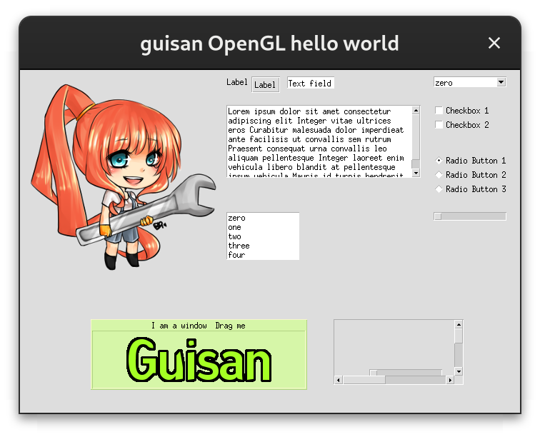

# GUISAN

## An SDL2 GUI construction toolkit

Guisan was forked from Guichan to create a simple GUI construction toolkit that is compatible with SDL 2.0.0+

## Features:

* Statically links to your applications to reduce runtime requirements
* Small, but effective

## Build requirements:

* scons

## Runtime requirements:

* SDL 2.0+
* SDL2_image
* SDL2_ttf
* SDL2_mixer

## Example

## License:

Released under the BSD license. See COPYING for more details
